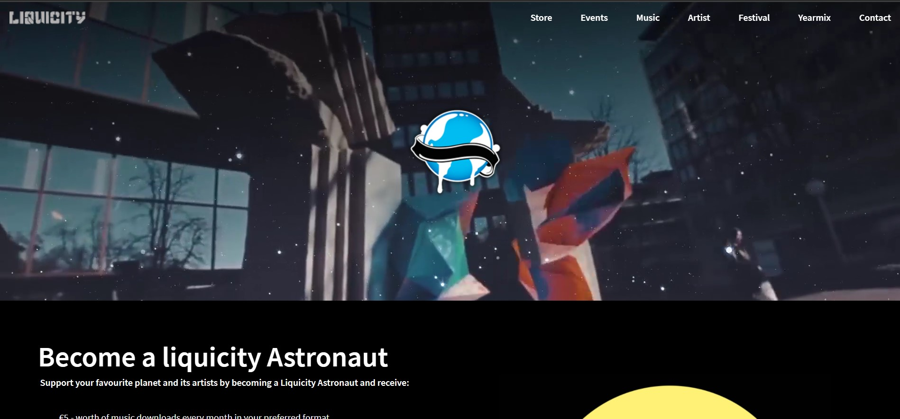
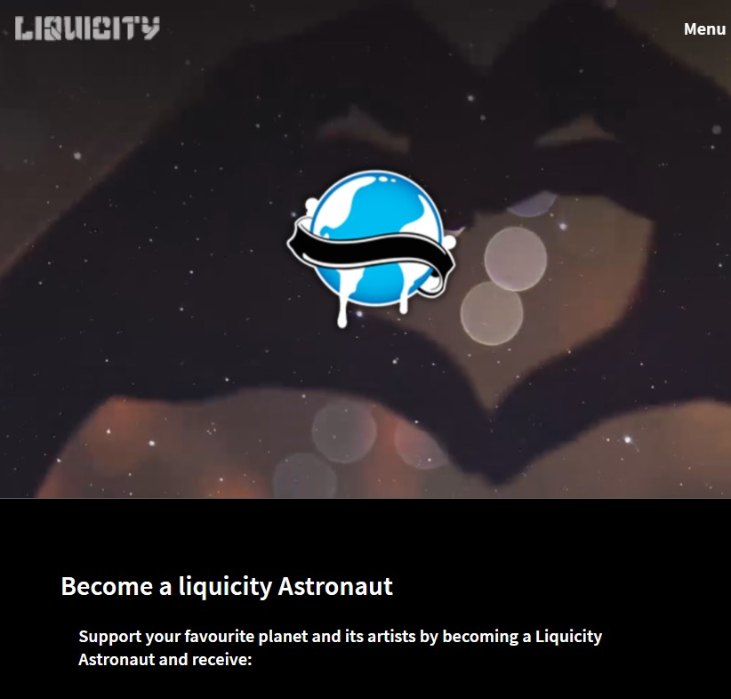
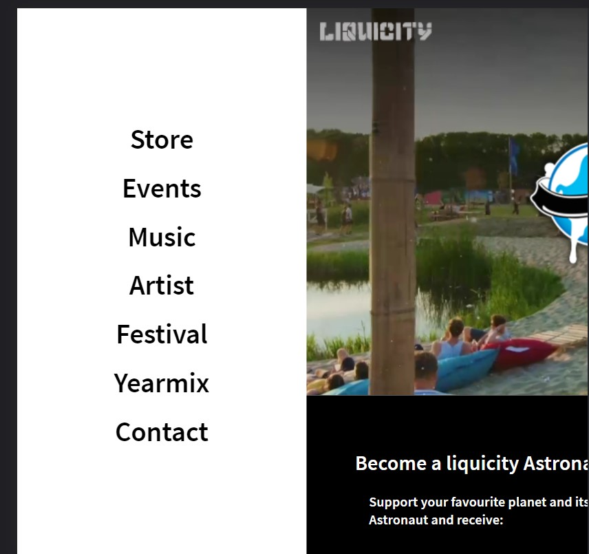
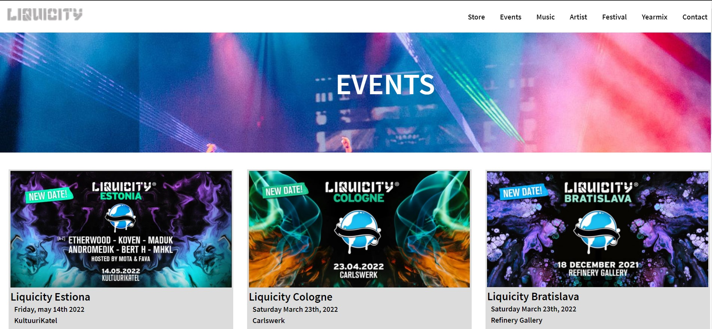

# Procesverslag

Dit procesverslag laat de voortgang en ontwikkeling zien voor het vak Frontend development. In dit procesverslag wordt beschreven welke stappen zijn genomen in ontwikkeling tot het eindproduct. Het eindproduct zijn 2 uitgewerkte webpagina's van een bestaande webpage, nagemaakt in HTML, CSS en Javascript.

## Jij

### Auteur:
Kirsten van Osch

#### Je startniveau:
Ik gok dat ik op niveau Rood zit, maar heb ambitie om uiteindelijk zwart te bereiken

#### Je focus:
Ik ben nog niet helemaal zeker over welke focus ik kies, want zowel responsiveness als surface plane vind ik interessant om te bestuderen. Mijn eerste ingeving is om me te focussen op responsiveness omdat ik dat nu nog een groot vraagstuk vind en ik het een uitdaging vind om dit uiteindelijk onder de knie te hebben. 
 

## Je website

uitwerken voor kick-off werkgroep

### Je opdracht:
Ik heb ervoor gekozen om de website van een platenlabel en eventorganisator Liquicity na te maken
https://liquicity.com/

#### Screenshot(s) van de eerste pagina (small screen): 
hier de naam van de pagina  

#### Screenshot(s) van de tweede pagina (small screen):
hier de naam van de pagina  

 

## Breakdownschets (week 1)

uitwerken na afloop 2e werkgroep

### de hele pagina: 

## Voortgang 1 (week 2)

uitwerken voor 1e voortgang

### Stand van zaken
het maken van een breakdown schets ging me vrij makkelijk af, vervolgens de html opzetten was ook nog geen probleem. Ik heb even wat moeilijkheden gehad met javascript, want dat was een beetje weggezakt. 

Iets waar ik dankzij de lessen en opdrachten heel snel begrip op kreeg was position. 

### Agenda voor meeting

We hebben van te voren geen agenda opgesteld.

### Verslag van meeting
hier na afloop snel de uitkomsten van de meeting vastleggen

- Maak meer comments bij de code
- Kies voor een eenheid (het liefst em) en wees daar consequent in. 
- maak gebruik van de css selectoren. 

## Voortgang 2 (week 3)

uitwerken voor 2e voortgang

### Stand van zaken
Ik heb heel veel moeite gehad met grid de afgelopen week. Ik probeerde een selectie met grid te positioneren, maar door de verschillende afmetingen
van elementen was dit vrij lastig. 

### Agenda voor meeting

Van te voren hebben we geen agenda gemaakt, maar zelf had ik vragen over het navigatiemenu. Hoe ik daar een event op kan zetten met javascript. 

### Verslag van meeting
hier na afloop snel de uitkomsten van de meeting vastleggen

Ik ben goed opweg. Het navigatie menu kan gefixt worden door een div te gebruiken en daarop een event met javascript toe te voegen. 

## Toegankelijkheidstest (week 4)

uitwerken na test in 8e voortgang

### Bevindingen
Lijst met je bevindingen die in de test naar voren kwamen:

#### Tab werkt niet overal
Wanneer je bij de events aankomt kun je niet zien welke afbeelding is geselecteerd. Dit kan je oplossen door de focus state aan te passen, maar na dit geprobeert te hebben lukte het niet dus heb ik het voor nu zo gelaten. Als ik meer tijd had gehad zou ik dit oplossen. 

#### Kleuren van buttons.
Op de event pagina staan 2 buttons met een zwarte tekst. Hierbij is het contrast best laag en niet goed leesbaar. dit heb ik aangepast door de tekst in de buttons te veranderen naar wit.  

## Voortgang 3 (week 4)

uitwerken voor 3e voortgang

### Stand van zaken
Ik liep deze week behoorlijk tegen het navigatie menu aan. Deze moet weer inklappen als je op de body van de pagina klikt, zonder de menu-button
te hoeven gebruiken. Daarnaast heb ik een behoorlijke tijd geworsteld met het positioneren van mijn elementen binnen het grid.

### Agenda voor meeting
samen met je groepje opstellen

Van te voren in het groepje niet echt besproken wat we wilde bespreken. Tijdens de meeting zijn we gewoon een voor een iedereen langs 
geweest om te kijken waar we staan en tegen welke problemen we aanlopen. Zelf loop ik tegen het probleem aan dat ik het navigatiemenu niet werkend krijg. Uiteindelijk na flink wat pogingen hulp gevraagd bij een klasgenoot en samen hebben we het probleem opgelost.

Door een div toe te voegen en die aan te spreken met javascript is het gelukt om het navigatiemenu functionerend te maken. 

### Verslag van meeting
hier na afloop snel de uitkomsten van de meeting vastleggen

- Mijn code ziet er heel netjes uit
- Qua responsiveness ben ik een heel eind op weg
- Het menu werkt nog niet helemaal, daar moet ik zelf nog even mee aan de slag en mocht ik er niet uit komen vraag ik om hulp. 

## Eindgesprek (week 5)

uitwerken voor eindgesprek

### Stand van zaken
Na 4 weken intensief coderen kan ik zeggen dat ik trots ben op het resultaat. Ik heb voor de focus responsive gekozen omdat ik dit in vorige opdrachten ontzettend lastig en ongrijpbaar vond. Dat is in de afgelopen tijd veranderd. Ik heb een veel beter begrip van css en wordt er ontzettend enthousiast van. 

De dingen waar ik de afgelopen 4 weken tegen aan ben gelopen zijn grid, het navigatie menu, het veranderen van de cursor en javascript. Om ermee bezig te zijn en mezelf erin vast te bijten heb ik veel dingen op kunnen lossen en daarvan geleerd. 

### Screenshot(s)

hier screenshot(s) van je eindresultaat

Hier zie je dat het navigatie menu bij een smallscreen weergegeven wordt als menu button en bij de desktopversie zie je het menu rechtsbovenin. 

## Bronnenlijst

continu bijhouden terwijl je werkt

Nb. Wees specifiek ('css-tricks' als bron is bijv. niet specifiek genoeg).

1. W3School selectoren https://www.w3schools.com/cssref/css_selectors.asp
2. CSS tricks https://css-tricks.com/almanac/properties/c/cursor/
3. Liquicity https://liquicity.com/
4. W3School transform https://www.w3schools.com/css/css3_2dtransforms.asp
5. W3School Javascrips https://www.w3schools.com/jsref/met_win_settimeout.asp
6. Lessen en opdrachten van FED 

